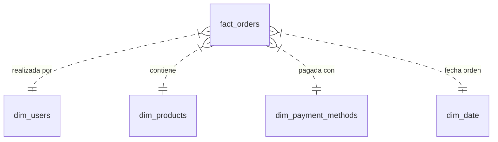

# Matriz de Bus y Diseño del Modelo Dimensional (Esquema Estrella)

## Objetivo
Transformar los datos transaccionales (OLTP) cargados en la fase anterior en un modelo dimensional (OLAP) optimizado para análisis de ventas y comportamiento de usuarios.

## Fact Table (Tabla de Hechos)

### `fact_orders`
Representa el detalle de cada transacción de venta.
- **Grano**: Una fila por producto en una orden (nivel de detalle de orden).
- **Fuente**: `ordenes` JOIN `detalle_ordenes`.
- **Métricas (Facts)**:
  - `cantidad` (int)
  - `precio_unitario` (decimal)
  - `total_linea` (cantidad * precio_unitario)
- **Foreign Keys (a Dimensiones)**:
  - `user_id` -> `dim_users`
  - `product_id` -> `dim_products`
  - `payment_method_id` -> `dim_payment_methods`
  - `order_date` -> `dim_date` (Role playing dimension si es necesario para fecha de envío, etc.)
- **Atributos Degenerados**:
  - `order_id` (útil para agrupar líneas de la misma orden)

## Dimension Tables (Tablas de Dimensiones)

### `dim_users`
Información descriptiva de los clientes.
- **Fuente**: `usuarios` JOIN `direcciones_envio` (opcional, si se modela como atributo del usuario o dimensión separada. Asumiremos dirección principal por ahora o SCD Tipo 2 si hubiera historia).
- **Atributos**:
  - `user_id` (PK)
  - `nombre`
  - `apellido`
  - `email`
  - `telefono`
  - `direccion` (ciudad, estado, codigo_postal, pais) - *Desnormalizado de direcciones_envio*

### `dim_products`
Información de los productos y su jerarquía de categorías.
- **Fuente**: `productos` JOIN `categorias`.
- **Atributos**:
  - `product_id` (PK)
  - `nombre_producto`
  - `precio_actual`
  - `categoria_nombre`
  - `categoria_descripcion`

### `dim_payment_methods`
Métodos de pago utilizados.
- **Fuente**: `metodos_pago`.
- **Atributos**:
  - `payment_method_id` (PK)
  - `nombre_metodo`

### `dim_date`
Dimensión de tiempo estándar para análisis temporal.
- **Fuente**: Generada (dbt_utils o script SQL).
- **Atributos**:
  - `date_id` (PK)
  - `anio`
  - `mes`
  - `dia`
  - `dia_semana`
  - `trimestre`
  - `es_fin_de_semana`

## Diagrama Conceptual

