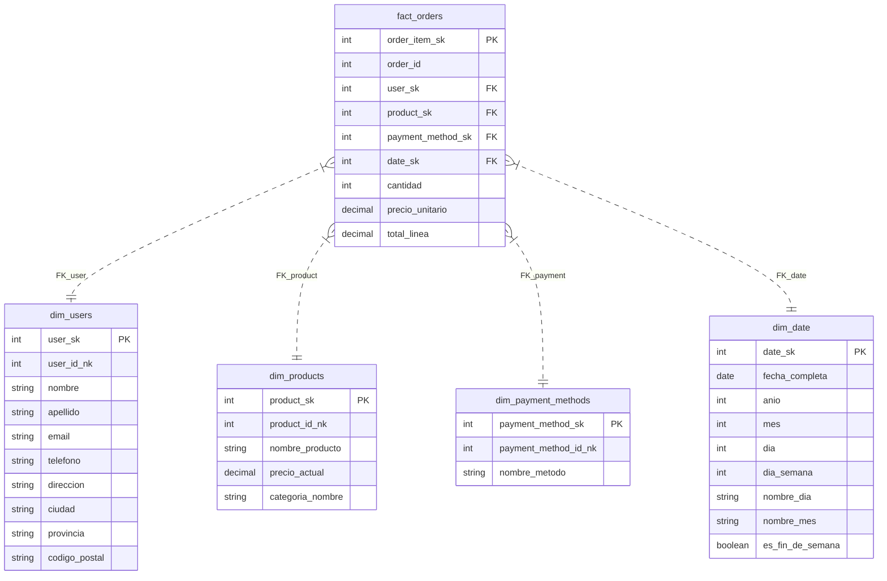

# Diagrama Entidad-Relación (ER) - Modelo Dimensional

Este documento detalla la estructura del esquema estrella diseñado para el Data Warehouse.

## Esquema Estrella

El modelo centraliza las métricas de negocio en la tabla de hechos `fact_orders` y rodea esta tabla con dimensiones descriptivas.

## Diccionario de Datos

### Claves Surrogadas (SK) vs Claves Naturales (NK)
- **SK (Surrogate Key)**: Claves primarias generadas por el Data Warehouse (generalmente enteros autoincrementales o hashes). Se usan para unir las tablas de hechos con las dimensiones. Permiten manejar historia (SCD Tipo 2) sin romper la integridad referencial.
- **NK (Natural Key)**: Claves originales del sistema fuente (ej. `id` en la tabla `usuarios`). Se mantienen en la dimensión para trazabilidad y búsquedas.

### Cardinalidad
- Todas las relaciones son de **Uno a Muchos** desde la Dimensión hacia la Fact Table.
- Una orden puede tener múltiples productos, por lo que la granularidad de `fact_orders` es a nivel de **línea de orden** (producto dentro de una orden).
